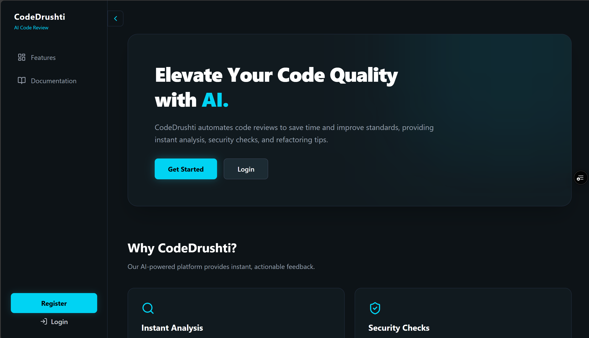
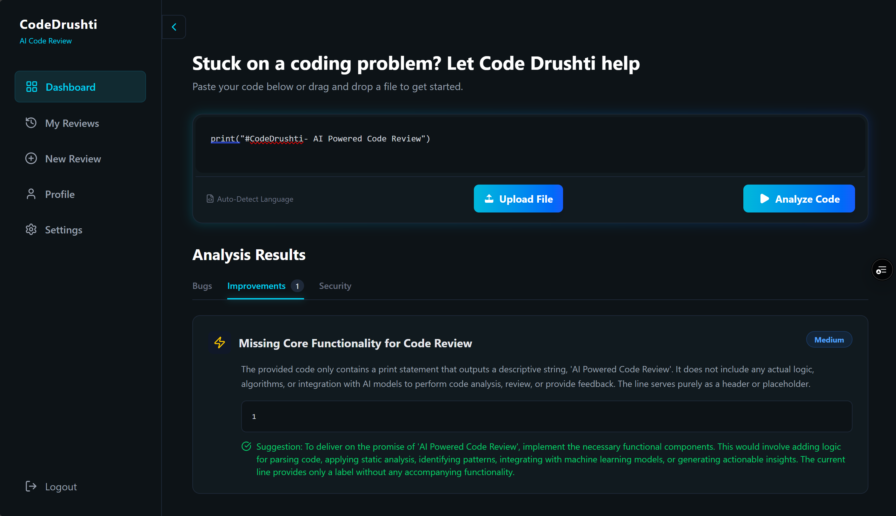

# CodeDrushti — AI‑Powered Code Review Web App

CodeDrushti is a MERN‑stack web application that helps developers review code with AI assistance. The Node/Express backend provides AI analysis endpoints that evaluate code snippets for potential bugs, complexity, and best‑practice violations. The Vite/React frontend offers an intuitive interface for submitting code, viewing actionable feedback, and navigating between landing, authentication, and dashboard views.

## Overview

- Purpose: Deliver AI‑assisted code reviews. Paste or upload code to receive automated insights, suggestions, and potential fix recommendations.
- Structure: Monorepo with `Backend/` for API and `Frontend/` for client app.
- Audience: Individual developers, students, and teams seeking quick feedback.

## Features

- AI code analysis: Send code to the backend and receive insights.
- Modular backend: `controllers`, `routes`, `services` for clean separation.
- React (Vite) SPA: Pages for Landing, Login, Register, Dashboard.
- Reusable UI components: `Sidebar` for navigation/layout.
- Extensible: Add linters, formatters, and custom rules.

## Screenshots

### Landing Page


### Dashboard - Code Review


## Tech Stack

- Backend: Node.js, Express
- Frontend: React, Vite
- Tooling: ESLint (frontend)
- AI Provider: Pluggable via `ai.service.js` (e.g., OpenAI/Gemini or similar)

## Project Structure

```
Backend/
	package.json
	server.js
	src/
		app.js
		controllers/
			ai.controller.js
		routes/
			ai.routes.js
		services/
			ai.service.js
Frontend/
	eslint.config.js
	index.html
	package.json
	README.md
	vite.config.js
	public/
	src/
		App.css
		App.jsx
		index.css
		main.jsx
		assets/
		components/
			Sidebar.jsx
		pages/
			Dashboard.jsx
			LandingPage.jsx
			Login.jsx
			Register.jsx
```

## Prerequisites

- Node.js 18+ (recommended) and npm
- Windows, macOS, or Linux

## Getting Started

Install dependencies for both Backend and Frontend.

```bash
# From the repo root
cd Backend
npm install

cd ../Frontend
npm install
```

### Environment Variables

Create a `.env` file in `Backend/` as needed by the AI service. Common variables include:

- `PORT`: Port for the backend server (defaults often to 3000 or 5000)
- `AI_API_KEY`: Key for any external AI service provider

Example (`Backend/.env`):

```
PORT=5000
AI_API_KEY=your_api_key_here
```

If the Frontend needs environment variables (e.g., API base URL), create a `.env` in `Frontend/` using Vite’s `VITE_` prefix:

```
VITE_API_BASE_URL=http://localhost:5000
```

### Running in Development

Run Backend and Frontend in two terminals:

```bash
# Terminal 1: Backend
cd Backend
npm run dev   # or npm start depending on package.json

# Terminal 2: Frontend
cd Frontend
npm run dev
```

The frontend dev server (Vite) will print a local URL (often `http://localhost:5173`). The backend will print its listening port (e.g., `http://localhost:5000`).

#### Optional: Single command with concurrently

If you prefer one command from the repo root, you can add a root `package.json` with a `dev` script using `concurrently`, or add such a script in one of the subprojects. Example root configuration:

```json
{
	"name": "codedrushti",
	"private": true,
	"scripts": {
		"dev": "concurrently \"npm:dev:backend\" \"npm:dev:frontend\"",
		"dev:backend": "cd Backend && npm run dev",
		"dev:frontend": "cd Frontend && npm run dev"
	},
	"devDependencies": {
		"concurrently": "^9.0.0"
	}
}
```

Then run:

```bash
npm install
npm run dev
```

## API

The AI API is organized under `Backend/src/controllers/ai.controller.js`, `Backend/src/services/ai.service.js`, and `Backend/src/routes/ai.routes.js`.

### Base URL

- Local: `http://localhost:<PORT>` (e.g., `http://localhost:5000`)

### Example Endpoints

Note: Exact paths may vary; common patterns are shown based on the current layout.

- `POST /api/ai/review` — Analyze a code snippet and return findings.

Request (JSON):

```json
{
	"language": "javascript",
	"code": "function sum(a,b){return a+b}"
}
```

Response (JSON):

```json
{
	"summary": "Function is simple; missing input validation.",
	"issues": [
		{ "type": "style", "message": "Consider spacing and semicolons." },
		{ "type": "robustness", "message": "Validate input types before adding." }
	],
	"suggestions": [
		"Add parameter type checks.",
		"Use consistent formatting via ESLint/Prettier."
	]
}
```

### Curl Example

```bash
curl -X POST \
	-H "Content-Type: application/json" \
	-H "Authorization: Bearer $AI_API_KEY" \
	-d '{"language":"javascript","code":"function sum(a,b){return a+b}"}' \
	http://localhost:5000/api/ai/review
```

### Browser `fetch` Example

```js
async function reviewCode(language, code) {
	const res = await fetch(`${import.meta.env.VITE_API_BASE_URL}/api/ai/review`, {
		method: 'POST',
		headers: { 'Content-Type': 'application/json' },
		body: JSON.stringify({ language, code })
	});
	if (!res.ok) throw new Error('Request failed');
	return res.json();
}
```

## Frontend Usage

- Start the dev server and open the Vite URL.
- Navigate between `LandingPage`, `Login`, `Register`, and `Dashboard`.
- Use the dashboard to paste or upload code and trigger reviews.
- The `Sidebar` component in `Frontend/src/components/Sidebar.jsx` provides navigation.

## Scripts

Backend `package.json` may include:

- `start`: Start the production server.
- `dev`: Start with nodemon for live reload (if configured).

Frontend `package.json` includes:

- `dev`: Start Vite dev server.
- `build`: Production build.
- `preview`: Preview built assets.

## Development Notes

- Lint the frontend code: `cd Frontend && npm run lint` (if configured via `eslint.config.js`).
- Keep services pure and controllers thin to isolate business logic.
- Add tests as needed (Jest/Vitest are good fits, not yet configured in repo).
- Consider adding rate limiting and input size limits to protect the AI provider.
- Configure CORS and HTTPS for secure client–server communication.

## Deployment

- Backend can be deployed to platforms like Render, Railway, or any Node hosting.
- Frontend can be deployed to Netlify/Vercel or served by the backend after `npm run build`.
- Set environment variables securely in your hosting provider.

## Troubleshooting

- Port conflicts: change `PORT` or Vite port via `vite.config.js`.
- CORS issues: configure CORS in `Backend/src/app.js` (e.g., `cors()` middleware).
- Missing `AI_API_KEY`: ensure your `.env` is loaded; restart dev servers.


